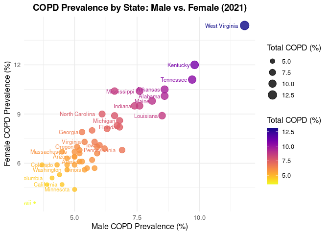

Individual Rmarkdown Report: Air Quality and Lung Disease in USA
================
Gretchen Hellstern
2025-10-29

- [Abstract](#abstract)
- [Background](#background)
- [Study Question and Hypothesis](#study-question-and-hypothesis)
  - [Questions](#questions)
  - [Hypothesis](#hypothesis)
  - [Prediction](#prediction)
- [Methods](#methods)
  - [First Analysis](#first-analysis)
  - [Interpretation of 1st Analysis](#interpretation-of-1st-analysis)
  - [Interpretation of 2nd Analysis](#interpretation-of-2nd-analysis)
- [Conclusion](#conclusion)
- [References](#references)

# Abstract

# Background

# Study Question and Hypothesis

## Questions

Do areas of low air quality have higher rates of lung diseases?

## Hypothesis

We expect areas with lower quality air on average will have higher rates
of lung disease and lung related mortality.

## Prediction

# Methods

## First Analysis

``` r
# Install (only needed once per project)
# install.packages(c("tidyverse", "viridis"))

# Load libraries
library(tidyverse)
library(viridis)

# Read in the data
copd <- read_csv("state_gender_data.csv")

# Remove the national total
copd <- copd %>% filter(State != "United States")

# Create scatterplot: Female vs. Male COPD prevalence
ggplot(copd, aes(x = Male_Percent, y = Female_Percent, 
                 size = Total_Percent, color = Total_Percent, label = State)) +
  geom_point(alpha = 0.8) +
  geom_text(aes(label = State), hjust = 1.2, vjust = 0.5, size = 3, check_overlap = TRUE) +
  scale_color_viridis(name = "Total COPD (%)", option = "C", direction = -1) +
  scale_size_continuous(name = "Total COPD (%)") +
  labs(
    title = "COPD Prevalence by State: Male vs. Female (2021)",
    x = "Male COPD Prevalence (%)",
    y = "Female COPD Prevalence (%)"
  ) +
  theme_minimal(base_size = 12) +
  theme(
    plot.title = element_text(size = 14, face = "bold", hjust = 0.5),
    legend.position = "right"
  )
```

<!-- --> \#
Discussion

------------------------------------------------------------------------

## Interpretation of 1st Analysis

## Interpretation of 2nd Analysis

# Conclusion

# References

2.  ChatGPT. OpenAI, version Jan 2025. Used as a reference for functions
    such as plot() and to correct syntax errors. Accessed 2025-10-29.
